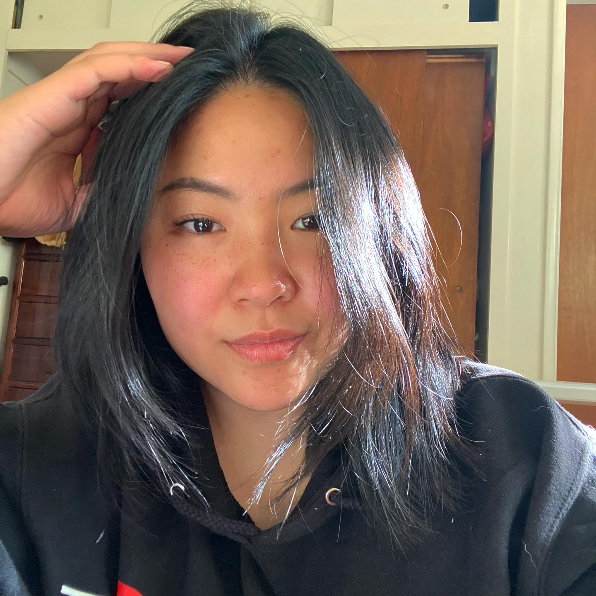
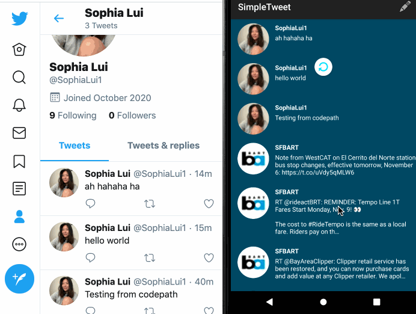

# **Sophia Lui's Page**



## Introduction: 
**Hello!** My name is Sophia, and I am *currently* a fourth year studying Math-CS. 

Something that I learned during quarantine (not COVID-19 related)... 
> **You work as you're dying to afford the help you need in order to keep you alive 😀 That's American health care system for you!!!**

Everyone must know this line of code: 
```
System.out.println("Hello, World!"); 
```

Currently building my portfolio website: [Sophia Lui | Student](https://serene-edison-5132bb.netlify.app/)

## Projects: 
More projects can be found on my [Github](https://github.com/sophiaallui), but here are a few! 

**Personal Portfolio** 

Currently building my portfolio website: [Sophia Lui | Student](https://serene-edison-5132bb.netlify.app/)

**Twitter Clone**

Twitter clone is by far one of the better projects that was put together. Here's the [README.md](https://github.com/sophiaallui/SimpleTweet/blob/master/README.md) for more details! 


Summary of the project: 
- live action update
- Clone has user specific feed 
- Made possible through the use of Twitter API 

## Random Things: 
How to make use of a stove: 
1. Turn on the stove
2. Watch the flames 
3. Turn off the stove

**BucketList** 
- [x] Go to a school by the ocean 🌊
- [ ] Travel to elsewhere besides Mexico, California, and Nevada, possibly travel to the East Coast, Hong Kong, Europe 🚃~ 
- [ ] Land a job 📈